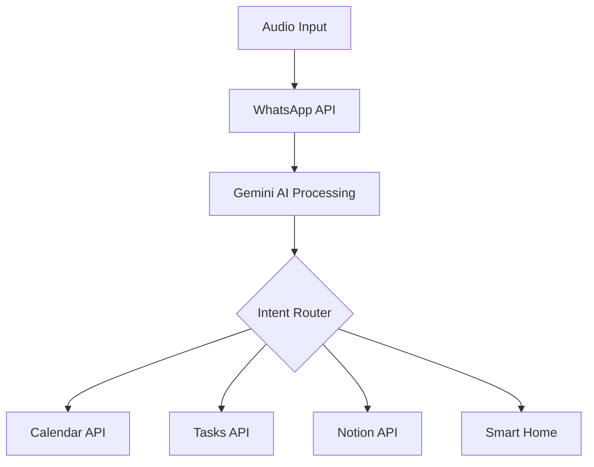

# AI Pipeline Documentation

## Overview
The AI pipeline is a core component that processes voice commands and images through Gemini AI, enabling intelligent task management and visual analysis.

## Pipeline Architecture


## Processing Stages

### 1. Input Processing
- **Audio Processing**
  - Capture via Meta Rayban glasses
  - Format validation
  - WhatsApp transmission
  - Background noise filtering

- **Image Analysis**
  - Direct capture from glasses
  - Format standardization
  - Metadata extraction
  - Context preservation

### 2. Gemini AI Integration
- **Configuration**
  ```python
  # Environment setup
  GEMINI_API_KEY required
  ```

- **Processing Capabilities**
  - Natural language understanding
  - Command intent detection
  - Context awareness
  - Image analysis
  - Smart time parsing

### 3. Intent Routing

#### Calendar Operations
- Event creation with smart validation
  ```python
  # Time validation example
  if time_has_passed:
      schedule_for_next_day()
  ```
- Meeting cancellation
- Schedule modifications
- Timezone handling (Asia/Kuala_Lumpur)

#### Task Management
- Task creation and updates
- Priority assignment
- Status tracking
- Completion handling

#### Notion Integration
- Database synchronization
- Content updates
- Metadata management

#### Smart Home Control
- Device state management
- Automation triggers
- Status reporting

## Error Handling
1. **Input Validation**
   - Format verification
   - Size limits
   - Content type checking

2. **Processing Errors**
   - Retry mechanisms
   - Fallback options
   - User feedback

3. **API Failures**
   - Circuit breaking
   - Rate limiting
   - Error reporting

## Performance Optimization
1. **Caching Strategy**
   - Redis implementation
   - TTL management
   - Memory limits

2. **Resource Management**
   - Thread pool optimization
   - Memory usage monitoring
   - Connection pooling

3. **Response Time**
   - Sub-800ms target
   - Performance monitoring
   - Bottleneck identification

## Best Practices
1. **Input Processing**
   - Validate early
   - Fail fast
   - Preserve context

2. **AI Integration**
   - Maintain API key security
   - Implement rate limiting
   - Monitor usage

3. **Output Handling**
   - Clear user feedback
   - Error transparency
   - Status updates

## Monitoring and Logging
1. **Performance Metrics**
   - Processing time
   - Success rates
   - Error frequency

2. **System Health**
   - Resource usage
   - API status
   - Cache efficiency

3. **User Feedback**
   - Command success rate
   - Understanding accuracy
   - Response quality
