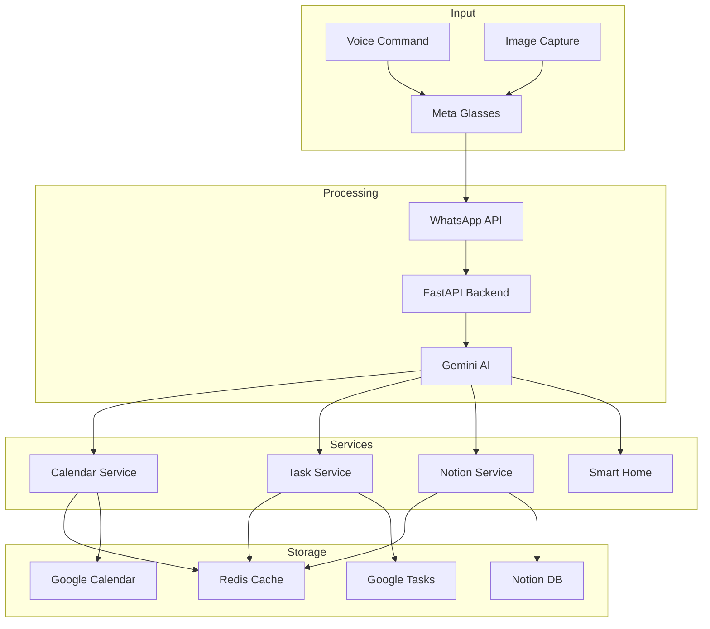
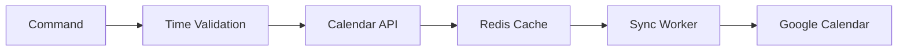
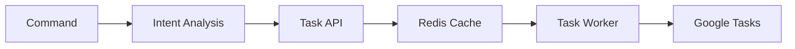
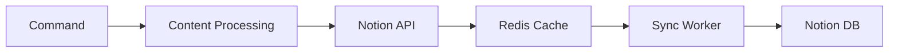

# Data Flow Documentation

## System Data Flow Overview



## Data Flow Stages

### 1. Input Capture
- **Voice Commands**
  - Captured by Meta Rayban glasses
  - Converted to audio format
  - Transmitted via WhatsApp

- **Image Input**
  - Direct capture from glasses
  - Format: JPEG/PNG
  - Size limits enforced
  - Metadata preserved

### 2. WhatsApp Processing
- **Message Handling**
  - Webhook reception
  - Authentication verification
  - Rate limiting
  - Message queuing

- **Data Validation**
  - Format verification
  - Size validation
  - Content type checking
  - Security scanning

### 3. Backend Processing
- **FastAPI Server**
  - Async request handling
  - Thread pool management
  - Error handling
  - Response formatting

- **Gemini AI**
  - Natural language processing
  - Intent detection
  - Context analysis
  - Command parsing

### 4. Service Integration

#### Calendar Flow


#### Task Flow


#### Notion Flow


### 5. Data Storage

#### Redis Cache
- **Structure**
  ```
  redis/
  ├── calendar/
  │   ├── events/
  │   └── reminders/
  ├── tasks/
  │   ├── active/
  │   └── completed/
  └── notion/
      └── sync/
  ```

- **TTL Management**
  - Events: 7 days
  - Reminders: 1 hour post-event
  - Tasks: 30 days
  - Sync data: 24 hours

#### External Storage
- Google Calendar
- Google Tasks
- Notion Database
- Smart Home State

### 6. Synchronization

#### Calendar Sync
- 5-minute intervals
- Bi-directional updates
- Conflict resolution
- Error recovery

#### Task Sync
- Real-time updates
- Status tracking
- Completion handling
- Priority management

#### Notion Sync
- Content synchronization
- Metadata updates
- Version control
- Conflict handling

### 7. Error Handling

#### Failure Modes
1. **Redis Unavailable**
   - In-memory cache fallback
   - Direct API calls
   - Exponential backoff

2. **API Failures**
   - Circuit breaking
   - Retry mechanisms
   - Error reporting
   - User notification

3. **Sync Failures**
   - Manual sync trigger
   - Consistency check
   - Data recovery
   - Log generation

### 8. Monitoring

#### Performance Metrics
- Response times
- Cache hit rates
- API latency
- Error frequency

#### Health Checks
- Service status
- Connection state
- Resource usage
- Queue depth

#### Logging
- Operation logs
- Error tracking
- Performance data
- User feedback
